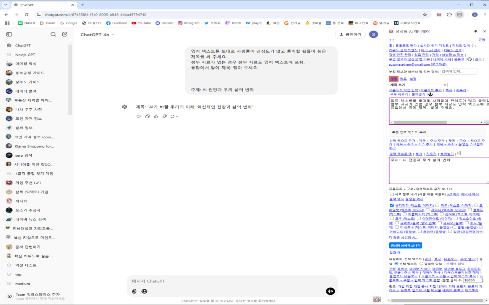
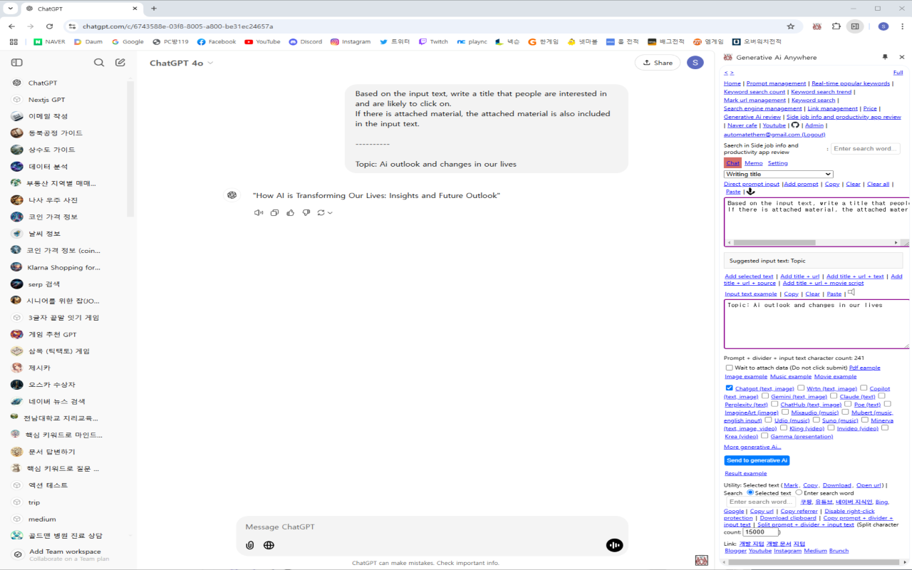
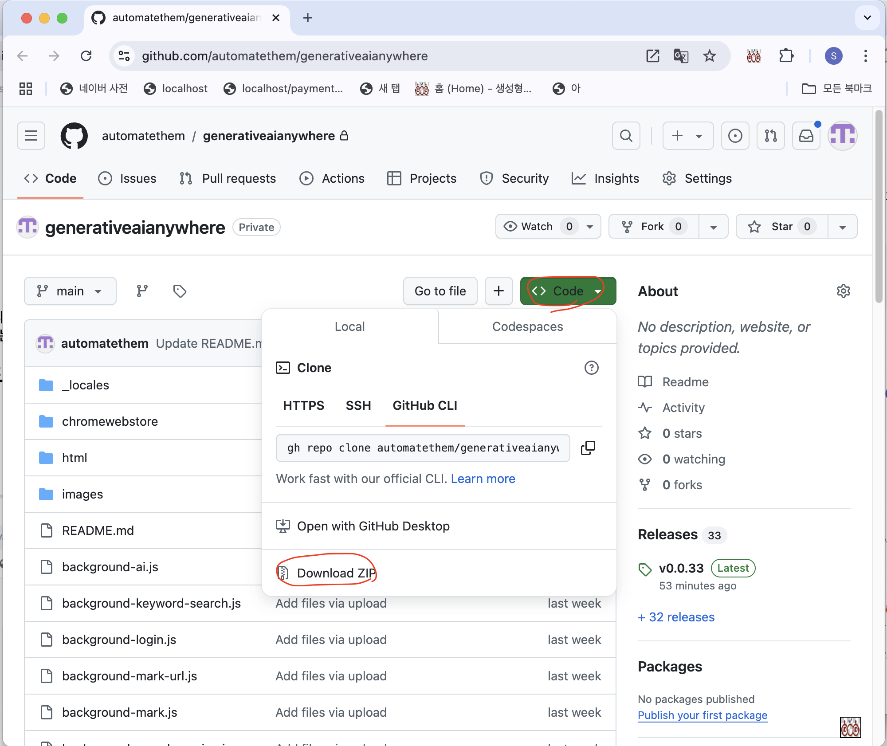
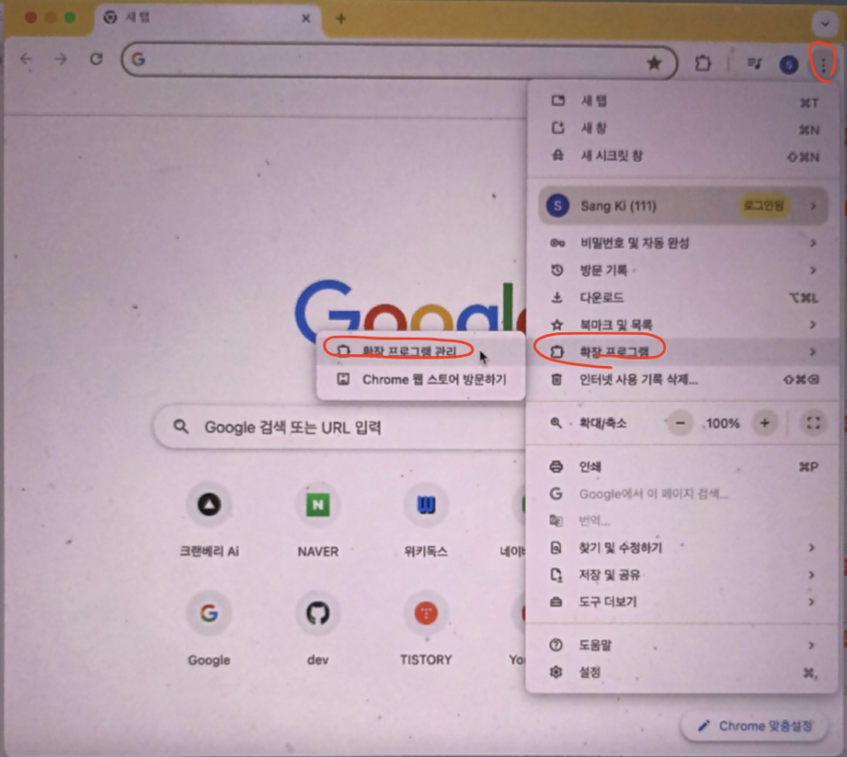
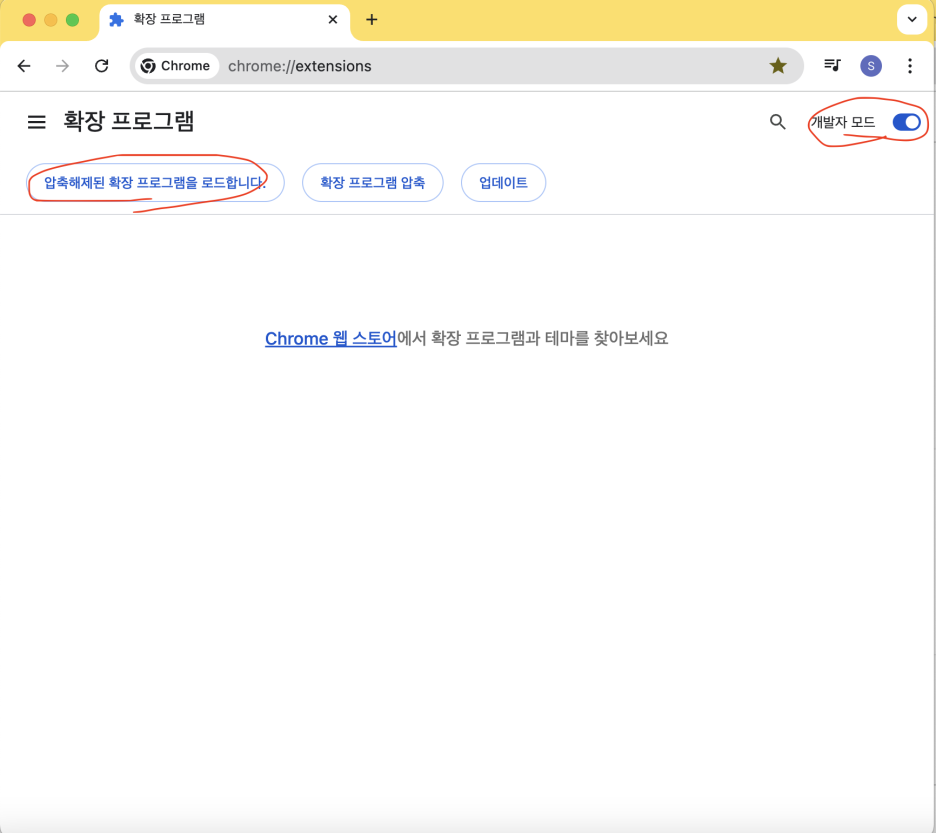
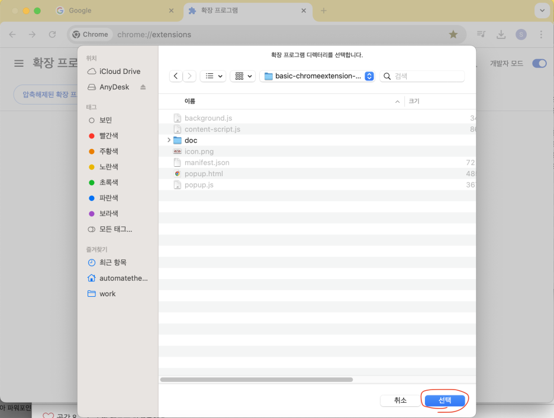

서비스 페이지 (Service page): https://www.marketinganywhere.ai/

## 마케팅 애니웨어

마케팅 애니웨어는 웹페이지 어디서나 마케팅 관련 작업을 쉽게 할 수 있게 도와주는 무료 오픈 소스 메타 생성형 Ai 크롬확장 앱입니다. 
 
-여러개의 웹페이지 컨텐츠(텍스트, 소스, 동영상 스크립트, pdf, 이미지, 음악, 동영상 등)에 대해 질문 혹은 재질문 할 수 있습니다. 
-여러개의 생성형 Ai에게 질문 혹은 재질문 할 수 있습니다. 
 
또한 아래 추가 기능을 제공 합니다: 
마크 (형광펜): 웹페이지에 형광펜으로 표시. 
동영상 스크립트 추출: 유튜브 동영상 자막 데이터를 텍스트로 추출. 
키워드 분석: 실시간 키워드 검색량 및 트렌드 파악. 
키워드 조합: 키워드 조합 기능 제공, 특히 지도 키워드 마이닝시 유용. 
마우스 우클릭 보호 해제: 복마우스 우클릭 보호된 페이지 해제로 콘텐츠 자유롭게 복사 . 
글자수 세기: 콘텐츠 글자수를 실시간으로 확인. 
스크롤 화면 캡처: 긴 페이지를 스크롤 캡처해 저장. 
프롬프트 분할: 프롬프트가 길 경우 작은 프롬프트들로 잘라 생성형 Ai에게 질문. 
 
지텁: <a href="https://github.com/automatethem/marketinganywhere" target="_blank">https://github.com/automatethem/marketinganywhere</a>

## Marketing Anywhere

Marketing Anywhere is a free, open source meta-generative Ai Chrome extension app that helps you easily perform marketing-related tasks on any webpage. 
 
-You can ask or re-question questions about multiple webpage contents (text, source, video script, pdf, image, music, video, etc.). 
-You can ask or re-question questions to multiple generative Ai. 
 
It also provides the following additional features: 
Mark (Highlighter): Mark webpages with a highlighter. 
Video Script Extraction: Extract YouTube video subtitle data as text. 
Keyword Analysis: Understand real-time keyword search volume and trends. 
Keyword Combination: Provides keyword combination function, especially useful for map keyword mining. 
Right-click Unprotect: Freely copy content by right-clicking and releasing protected pages. 
Character Count: Check the number of characters in content in real time. 
Scroll Screen Capture: Scroll and capture long pages to save them. 
Split Prompt: If the prompt is long, break it into smaller prompts and ask the generative AI questions. 
 
Github: <a href="https://github.com/automatethem/marketinganywhere" target="_blank">https://github.com/automatethem/marketinganywhere</a>

## 화면 캡처 (Screen Capture)

한국어

English

## 크롬 스토어에서 설치 (Install from Chrome Store)

https://chromewebstore.google.com/detail/%EC%83%9D%EC%84%B1%ED%98%95-ai-%EC%95%A0%EB%8B%88%EC%9B%A8%EC%96%B4/dmhapkamaakgininoknmmfppojbeekdb

## 개발자 모드에서 설치 (Install in developer mode)

압축 파일을 다운습니다. (Download the compressed file.)

우상단 점 세개 - 확장 프로그램 - 확장 프로그램 관리 (Three dots in the top right corner - Extensions - Manage Extensions)

다운 받은 압축 파일을 풉니다. (Unpack the downloaded compressed file.)

개발자 모드를 체크합니다. (Check developer mode.)

"압축해제된 확장 프로그램을 로드합니다" 클릭후 크롬확장 소스가 압축 되 있으면 압축을 풀고 폴더 지정 (Click "Load unpacked extension" and if the Chrome extension source is compressed, unpack it and specify the folder.)

편리한 사용을 위해 핀을 고정합니다. (Secure the pin for easy use.)

