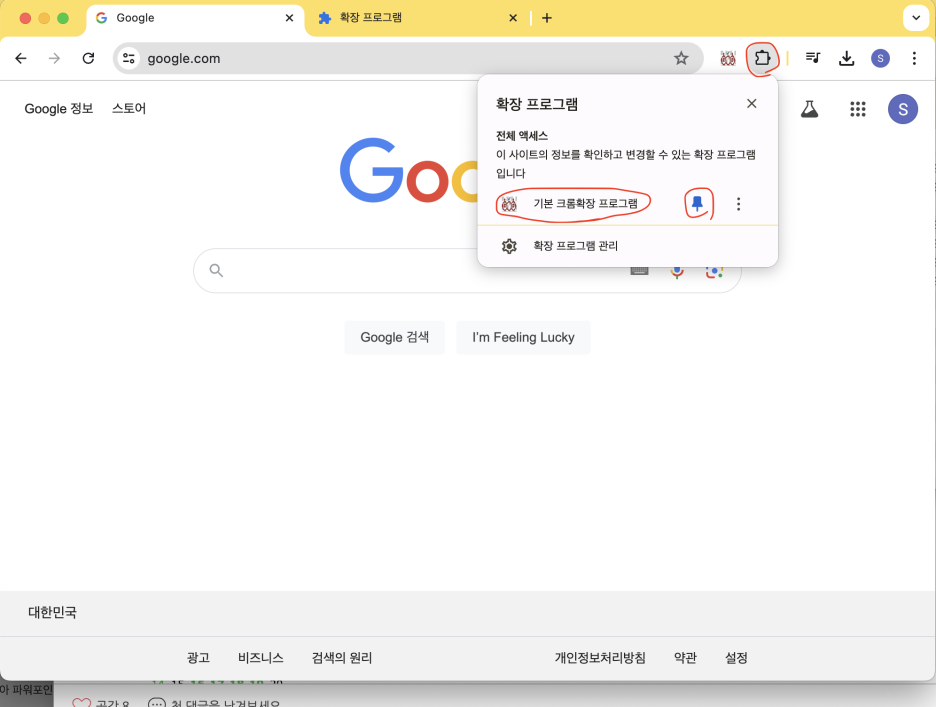

생성형 Ai 애니웨어 (Generative Ai Anywhere)

https://www.generativeaianywhere.ai/

## 실행 화면 캡처 (Screen Capture)

한국어

English

## 크롬 스토어에서 설치 (Download chrome extension app)

스토어 등록중 입니다 등록되는대로 링크 걸어 놓겠습니다.

## 개발자 모드에서 설치 (Install in Dev mode)

압축 파일을 다운습니다. (Download zip file)

우상단 점 세개 - 확장 프로그램 - 확장 프로그램 관리  
(Right 3 dots - Extension program - Manage extenson program)

다운 받은 압축 파일을 풉니다. (Unzip downloaded zip file.)

개발자 모드를 체크합니다. (Check dev mode.)

"압축해제된 확장 프로그램을 로드합니다" 클릭후 크롬확장 소스가 압축 되 있으면 압축을 풀고 폴더 지정 (Click “Load unzipped extension” and if the Chrome extension source is compressed, unzip it and specify a folder.)

편리한 사용을 위해 핀을 고정합니다. (Check pin for easy use.)

